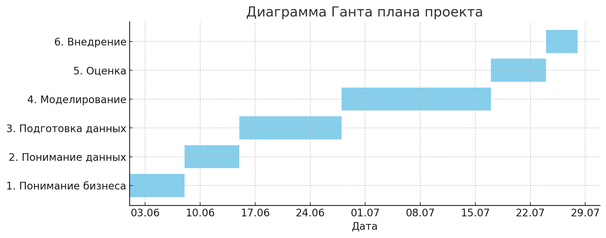

# 1. Business Understanding

**Цель:** определить скоуп проекта и ключевые вопросы для старта.

- **Организационная структура**
  - Заказчик / разработчик проекта: Хомидов Далер Зафарович  
  - Основные пользователи: разработчики среднего бизнеса и интеграторы маркетплейсов, использующие open-source решение  
  - Контакт: justjoke.exe@gmail.com  

- **Бизнес-цель проекта**  
  Увеличение релевантности рекомендаций для пользователей  

- **Существующие решения**  
  - Kaggle Competitions: Instacart Market Basket, H&M Personalized Fashion Recommendation  
  - Open-source библиотеки: Surprise, LightFM, RecBole и др.  

---

# 1.1 Assessing Current Solution

**Цель:** оценить ресурсы, доступность и риски существующей инфраструктуры.

- **Ресурсы и оборудование**  
  - Команда достаточна для разработки.  
  - Основной риск: нехватка времени (работа и учёба).  
  - Доступное железо: локальная машина; при необходимости аренда виртуалки.  

- **Данные**  
  - Источники: Kaggle (Instacart Market Basket, H&M Personalized Fashion Recommendation).  
  - Хранение: локально и на арендованной виртуалке.  
  - Внешние данные не требуются.  

- **Экспертная поддержка**  
  Метрики и разметка предоставлены в соревнованиях, дополнительная поддержка не требуется.  

- **Риски и план их уменьшения**  
  1. **Не уложиться в сроки**  
     - Дифференцированные дедлайны: «зелёный» (целевой), «чёрный» (окончательный); еженедельный контроль.  
  2. **Недостаток оборудования**  
     - При необходимости закупка/аренда виртуалки или добавление GPU.  
  3. **Отсутствие закономерностей**  
     - Фолбэк: использование baseline решений Kaggle; анализ нескольких датасетов.  

---

# 1.2 Data Mining Goals

**Цель:** сформулировать технические задачи и критерии успеха модели на выбранных датасетах.

- **Задачи**  
  1. **Instacart Market Basket**: предсказать набор товаров (top-N), которые пользователь добавит в следующий заказ.  
  2. **H&M Personalized Fashion Recommendation**: рекомендовать 12 товаров, которые пользователь купит на следующей неделе, оптимизируя MAP@12.  

- **Метрики оценки**  
  - Precision@10  
  - Recall@10  
  - NDCG@10  

- **Критерии успешности**  
  - Precision@10 ≥ 0.20  
  - Recall@10 ≥ 0.40  
  - NDCG@10 ≥ 0.30  
  - Отслеживать относительный рост метрик на 5–10 % от baseline.  

- **Альтернативная оценка**  
  Сравнение с официальными baseline решениями Kaggle; ручная экспертная проверка выборки рекомендаций.  

---

# 1.3 Project Plan

**Цель:** расписать план по шести фазам CRISP-DM с оценкой сроков и ресурсов.

| Фаза                         | Основные задачи                                               | Сроки           |
|------------------------------|---------------------------------------------------------------|-----------------|
| **1. Business Understanding**| Сбор ответов на ключевые вопросы из раздела 1                 | до 2025-06-08   |
| **2. Data Understanding**    | Сбор и обзор данных, EDA, оценка качества                     | до 2025-06-15   |
| **3. Data Preparation**      | Очистка данных, обработка пропусков и выбросов, генерация фич | до 2025-06-28   |
| **4. Modeling**              | Выбор моделей, обучение, валидация, подбор гиперпараметров    | до 2025-07-17   |
| **5. Evaluation**            | Оценка по выбранным метрикам, сравнение с критериями          | до 2025-07-24   |
| **6. Deployment**            | Интеграция, настройка мониторинга, сбор обратной связи        | до 2025-07-28   |

